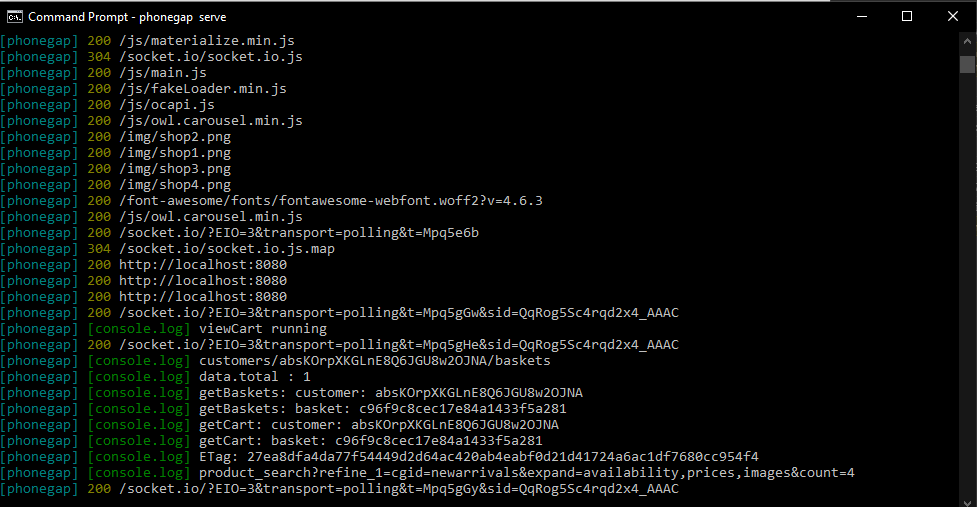

# Salesforce Commerce Cloud Cordova App

This project will serve as a local NodeJS based Proxy server that will forward requests to an Salesforce Commerce Cloud OCAPI instance. This can be used for purposes such as testing 3rd party apps using OCAPI as well as integration for mobile/browser apps. The configuration of site_id, client_id etc... are configured at the Proxy level rather than in the app directly. Coresponding Mobile App: {future link}

## Getting Started

This app is configured as a standard Phonegap/Cordova Project.

### Prerequisites

* [**Salesforce Commerce Cloud - configured for OCAPI**](https://www.salesforce.com/products/commerce-cloud/overview)
* [**NodeJS**](https://nodejs.org) 
* [**PhoneGap**](https://phonegap.com) 
* [**OCAPI-Proxy**](https://github.com/johnfacey/ocapi-proxy)
* [**Visual Studio Code**](https://code.visualstudio.com)

## Setup Cordova Project 
```
npm install -g phonegap
phonegap create path/to/myApp
```
Go into the path and run

```
phonegap serve
```

Place the www files (from the repo) into the www folder located in your Cordova Project



### Installing

In Progress

## Running the tests

From the command line: phonegap serve
Future directions for Ionic, Cordova etc..

## Deployment

In Progress

## Built With

* [NodeJS](https://nodejs.org/) 
* [Express](https://expressjs.com/) - Minimalist Web Framework for Node

## Authors

* **John Facey II** - *Lead Developer* - [johnfacey](https://github.com/johnfacey) - [Twitter](https://twitter.com/johnfacey)

## License

See the [LICENSE.md](LICENSE.md) file for details

## Acknowledgments

* **NodeJS** - (https://nodejs.org)
* **Visual Studio Code** - (https://code.visualstudio.com/)